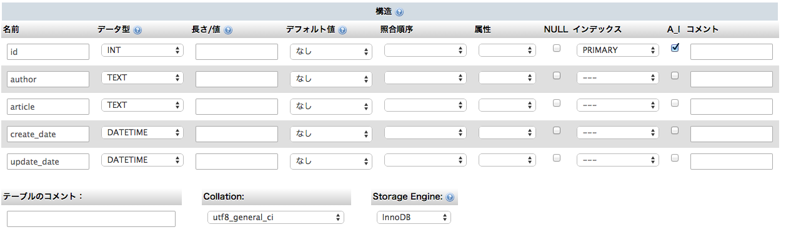

Lesson4 もっとそれっぽいプログラム - にわとりblog -
===================================

とりあえずデータを保存できるようにしよう
-----------------------------------

ロバのみみblogは投稿した瞬間には記事が見れますが、
残念なことに他の人に記事を見せるといったようなことができません。

何故かというと、投稿したデータをどこにも保存していないため、再度同じ記事を表示しようとしても
誰も覚えてないから表示することができないためです。

なので、まずはデータを保存する方法をお勉強していきましょう。

データベースのおはなし
-----------------------------------

データを保存するためには何かに **永続的(一時的ではなく、ずっと)に保存** しておかないと、
使いたい時にデータを呼び出すことができません。

また、データを呼び出す時に **データの検索** ができないと、すべてのデータを呼び出して、
一つひとつ内容を確認して…と何やら頭の悪そうなことをしないといけなくなります。

さらに[Lesson1](../Lesson1)で学んだ **CRUD** はできないとどうしようもありません。

これらを便利にやってくれる仕組みのことを **データベース** と言います。

XAMPPをインストールしている段階で「MySQL」というデータベースソフトがインストールされているので
それを使用します。

データを永続的に保存するハコを作る
------------------------------------

MySQLでは *テーブル* と言う入れ物を事前に準備しておいて、そこに入れる必要があります。

blogの場合こんなハコがあれば大丈夫かな?

| 名前 |用途| データの形 |
|----|-----|-------|
|id|記事を特定する|数字|
|article|記事の本文|テキスト|
|author|記事の著者|テキスト|
|create_date|記事の作成日|日付|
|update_date|記事の更新日|日付|

MacのXAMPPの場合はphpMyAdminからこのようなハコを作ることができます。

まずはblogというデータベースを作ります。phpMyAdminから簡単に作れるので作ってください。

次にarticlesというハコ(テーブル)を作ります。

phpMyAdminで作る時はこんな感じになります。



データ型のところの *INT* は「整数のデータ」という意味です。
同様に *TEXT* はテキスト(文字の情報)、 *DATE* は日付の情報という意味になります。

idのところの *インデックス* のところに「PRIMARY」と書かれていますが、これは
PRIMARYが設定されているところは *必ずダブってない* ことを保証する列になります。

どんなところで使用するかというと、blogの記事の場合、

* 同じ本文
* 同じ著者
* 同じ作成日
* 同じ更新日

の記事があっても一応はおかしくないはずです。

なんですが、間違って2つ作っちゃったので一つは消したい。
といった時にCRUDのD(DELETE:削除)の命令を出すのですが、
**どれを消していいのかわからないので2つ消しちゃう** ということになりかねません。
なので、内容諸々はダブってても必ずダブっていない情報(今回でいうとid)を
付与しておくことで、Dの時に確実にどれを消す!っていうのを指定できることができます。

また、CRUDのR(Read:読み込み)の時にも「これを読み込みたい!」っていった時にハコに入っている
情報を検索しないといけないのですが、IDに事前にインデックス(本の索引)を用意しておくことで
すばやくハコのどこにあるか検索することができます。

PRIMARYを指定すると *ダブってない* のと *インデックスを作る* の2つを同時に満たしてくれます。
とりあえずテーブル作る時にはできるだけ何かしらPRIMARYの列を用意するようにしましょう。

あと謎の *A_I* というのがありますが、これは「Auto Increment」の略です。
Incrementとは「1つ増やす」という意味で情報を追加するたびに1ずつ増えたデータを自動的に入れてくれる機能を有効にする。という意味になります。

idはダブっちゃ困るのでこのA_Iを使用して自動的に増やしていけばダブることはない。のでチェックが入っています。

こまかい話は今は覚えなくても大丈夫です。なんかあのせんせーがわけのわからないこと言ってたんだな。くらいで今の時点では大丈夫です。
(もちろん、お仕事としてプログラムを作っていく時には大切な概念なので、しっかり覚えておいたほうがいいですが…)

こんなかんじでハコを作ることができます。

#### SQLで書く版

```
CREATE TABLE articles (
  `id` INT NOT NULL AUTO_INCREMENT ,
  `author` TEXT NOT NULL ,
  `article` TEXT NOT NULL ,
  `create_date` DATETIME NOT NULL ,
  `update_date` DATETIME NOT NULL,
  PRIMARY KEY(id))
   ENGINE = InnoDB CHARACTER SET utf8 COLLATE utf8_general_ci;
```

データを入れてみよう
------------------------------

ハコを作ったので、データを入れてみましょう。
通常データを入れる時にはSQLというものを使用してCRUDなことをします。

教科書151ページに書いてある「レコードを挿入する「INSERT INTO」」という部分にデータを挿入する方法が書いてあります。

```
INSERT INTO ハコの名前 (列の名前1,列の名前2,...) VALUES (列の名前1に入れるデータ,列の名前2に入れるデータ,...)
```

という記述方法を使用するとデータを入れることができます。

詳細は[add.php](add.php)を参考に実際に受け取ったデータをハコに入れてみましょう。

最初の
```php
// データを追加してみる…前にデータベースの設定いろいろやる。こ
$host = 'localhost';
$dbname = 'blog';
$charset = 'utf8';
$user = 'root';
$password = '';
$driver = 'mysql';
$connection = sprintf("%s:host=%s;dbname=%s;charset=%s",$driver,$host,$dbname,$charset);
$dbh = new PDO($connection,$user,$password);
```
の部分はデータベースに接続するための **おまじない** だと思っていただければいいかと思います。

実際にハコにデータを入れている部分は
```php
$now = date('Y-m-d H:i:s'); // 投稿時間を取得している。

$query = 'INSERT INTO articles(article,author,create_date,update_date)
 VALUES (:article,:author,:create_date,:update_date)';
// SQLが実行可能な状態にしておく
$stmt = $dbh->prepare($query);

// valuesのそれぞれの場所に値をセットしていく。PDO::PARAM_STRはそれが"文字"だよーっていう意味
// 整数のデータ入れたい時はPDO::PARAM_INTって入れてね。
$stmt->bindParam(':article', $_POST['article'],PDO::PARAM_STR);
$stmt->bindParam(':author', $_POST['name'],PDO::PARAM_STR);
$stmt->bindParam(':create_date',$now ,PDO::PARAM_STR);
$stmt->bindParam(':update_date',$now ,PDO::PARAM_STR);

// 実 行 ! !
$stmt->execute();
```
になります。`$query`に書かれているINSERT INTOという文字がありますが、
これがデータベースにデータをINSERT(挿入)しろ!っていう命令になります。
(教科書でいえば151ページ参考)


何も不備が無ければデータベースにデータが格納されています。いえい。

## 表示させなきゃ何の意味もない

ええ。格納されてるだけでは何も意味がありません。

表示もできなければ何もありません。CRUDのRです。
表示用のプログラムを書いてみましょう。

まずは記事IDが1になっているものを表示してみましょう。

表示用のプログラムとして[view.php](view.php)を用意しました。
テンプレートは[templates/output.tpl](templates/output.tpl)にあります。

viw.phpの前半部分はadd.phpと同じです。queryがデータを呼び出す時に使う「SELECT」になってます。


```php
// ここからがadd.phpと違うところ。データ呼び出してみるよ!
$query = 'SELECT id,article,author,create_date,update_date FROM articles WHERE id = :id';
$stmt = $dbh->prepare($query);
$stmt->bindValue(":id",1,PDO::PARAM_INT);
$stmt->execute();
$data = $stmt->fetch(PDO::FETCH_OBJ);
```

を実行することでidが1の記事を呼び出し、`$data`の中に記事の情報を格納しています。

取り出したデータをvar_dumpという、変数の中身を表示する関数を使用して確認してみます。

```php
var_dump($data);
```
と実行すると…

…

あとはTwigを使用してデータをはめこめばOKです。

$dataの中から各種情報を取り出す時にはアロー演算子を使用します。

```php
$data->article
```
とやるとarticleの情報を取得することができます。

あとは…ね。

### 課題

input.htmlからいくつか記事を登録して記事IDが2、3、4…の記事を表示をしてみよう。
できればURLをちょっとイジることでプログラムを改変せずに記事IDを変えれるようにしよう。

ヒントは教科書182ページ(そのまま)です。
